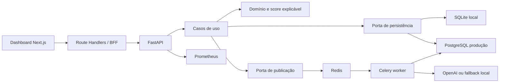

# Arquitetura

O Mobility Guard é um monólito modular no backend, acompanhado por um dashboard Next.js e um
worker independente. As regras de negócio não conhecem HTTP, banco, Redis nem SDKs externos.

## Limites

- `domain`: entidades, invariantes e detector puro.
- `application`: casos de uso e portas definidas com `Protocol`.
- `infrastructure`: SQLite, SQLAlchemy/PostgreSQL, Celery e provedor de IA.
- `api`: transporte HTTP, autenticação, erros, observabilidade e schemas.
- `dashboard`: BFF server-side e interface React; a chave da API não chega ao navegador.

## Decisões

### Monólito modular

O volume inicial não justifica múltiplos serviços de negócio. Os limites internos permitem extrair
o worker ou a análise como serviços independentes quando houver necessidade operacional real.

### Score síncrono, explicação assíncrona

O score barato e auditável fica no caminho síncrono. O trabalho sujeito a latência, custo e falha
externa vai para a fila. A persistência ocorre antes da publicação, e a falha do broker é registrada
sem perder a transação.

### Banco substituível

SQLite simplifica demonstrações. PostgreSQL usa pool, transações explícitas, índice por cliente e
data, JSON para evidências e migrações Alembic. Ambos implementam a mesma porta.

## Segurança

- segredos são lidos apenas do ambiente;
- o dashboard usa um BFF para não expor `API_KEY` ao cliente;
- `customer_id` não é enviado ao modelo generativo;
- `external_id` único fornece idempotência e proteção contra corrida no banco;
- resultados determinísticos permanecem disponíveis quando fila ou IA falham;
- request IDs permitem correlação sem registrar o payload integral.

## Próximas extensões

1. Autenticação OIDC e autorização por papel.
2. Outbox transacional para garantia forte entre PostgreSQL e Redis.
3. Localização, velocidade impossível e grafo de estabelecimentos.
4. Modelo supervisionado calibrado, mantendo explicações por regra.
5. OpenTelemetry e dashboards Grafana.
6. Testes de contrato e carga no pipeline de CI.
